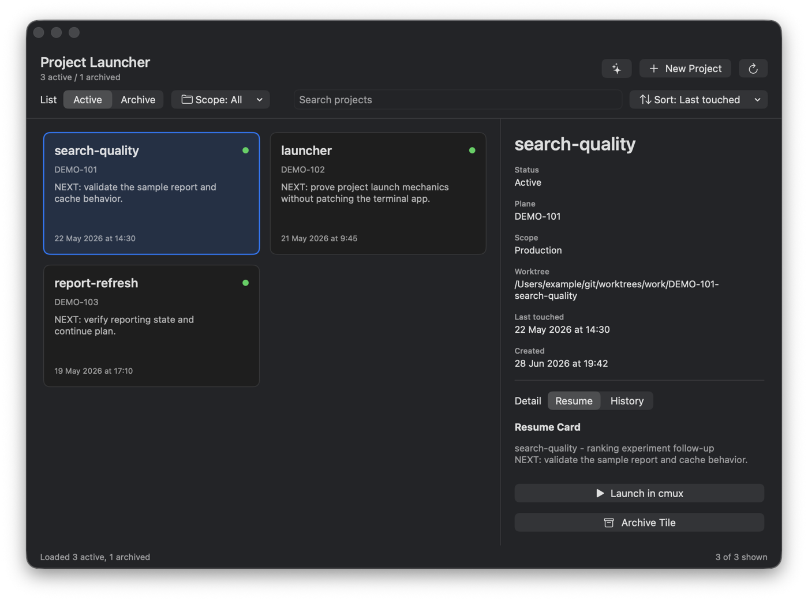
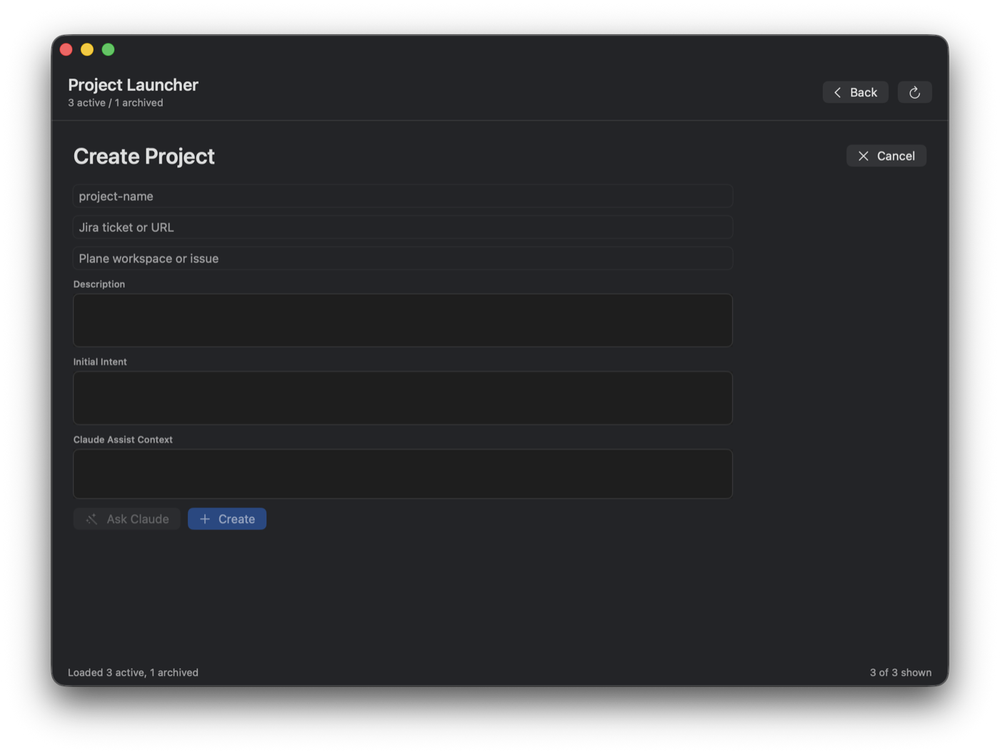

# cmux Project Launcher

Native macOS launcher for durable cmux project workspaces.

The app reads a local `/start`-style progress catalog, opens or resumes the
matching cmux workspace, and starts Codex/Claude panes through the configured
local launchers. It drives the supported `cmux` CLI; it does not patch cmux.

## Screenshots

Project list and resume context:



Create-project flow:



## What It Does

- Lists active and archived projects from progress files.
- Shows resume/history context from the project metadata and task-state file.
- Launches a project workspace with Codex and Claude panes.
- Names the underlying Claude conversation `claude-<session>` at boot and
  confirms Codex's `codex-<session>` rename before sending either start prompt.
- Archives only the exact AMQ message IDs present before a reused mailbox is
  launched; messages arriving after the two-agent snapshot remain queued.
- Defers AMQ wake registration until rename and both start submissions have
  completed, so queued messages cannot interrupt launcher control traffic.
- Identifies launcher workspaces by their structured project metadata, so an
  internal suffixed AMQ room still reopens the existing project workspace.
- Normal launch keeps the visible workspace title equal to the project name;
  AMQ collision suffixes remain internal session metadata. The separate
  create-project helper may use a temporary collision-safe helper name.
- Reattaches only when the matching AMQ room has exact UUID wake targets and
  both surface TTYs still run the expected agent processes; a restored plain
  shell is reported as degraded.
- Refuses mixed or ambiguous AMQ/cmux state instead of creating duplicates.
- Creates a new project by preparing a progress scaffold and handing a reviewed
  brief to Claude once the queued delivery marker reaches Claude's live input.
- Archives and restores project progress files through the configured
  `commit-progress.sh`.
- Offers temporary ad-hoc cmux workspaces that are not saved as projects.

## Requirements

- macOS with Swift 6.
- cmux 0.64.20 or newer installed, with the cmux CLI available at
  `/Applications/cmux.app/Contents/Resources/bin/cmux` or via
  `CMUX_PROJECT_LAUNCHER_CMUX`. Version 0.64.20 contains the upstream Codex
  YOLO/danger-mode restore fixes required by these workspaces.
- AMQ CLI installed. The launcher prefers explicit paths and common install
  locations before falling back to `PATH`.
- Local shell launchers for normal project launch:
  - `amq_codex <session>` for Codex.
  - `amq_claude <session> -- <agent-arguments>` for Claude. Inside cmux it must
    execute the per-surface `CMUX_CLAUDE_WRAPPER_SHIM`, not a bare Claude
    binary, so cmux can record a resumable Claude session.
  - Both launchers must honor `AMQ_COOP_WAKE_FLAG=--no-wake`; the project
    launcher performs the exact-surface reattach after its control flow.
  - Any Claude SessionStart hook that emits `sessionTitle` must preserve an
    explicit `--name` from the cmux launch metadata; otherwise it will replace
    the launcher's `claude-<session>` name immediately after boot.
- The create-project helper intentionally keeps its privileged
  `coopcodex <session>` and `coopcc <session> -- <agent-arguments>` defaults.
- Optional: Claude CLI for the "Ask Claude" draft helper.
- Optional: `/start` progress tooling, including `start-precompute` and
  `commit-progress.sh`, if you want project catalog and create/archive support.

## Build And Run

```bash
bin/build-app-bundle
open ~/Applications/CmuxProjectLauncher.app
```

The bundle copies the shell helpers into the app resources so the app can launch
from Finder, Spotlight, Raycast, or `open`.

`swift run cmux-project-launcher` is useful while developing. Do not open the raw
SwiftPM executable from `.build/.../debug` directly; LaunchServices may open it
inside a terminal. The raw-executable guard redirects to the `.app` bundle when
it can.

## Configure

Common overrides:

```bash
export CMUX_PROJECT_LAUNCHER_WORKSPACE_ROOT="$HOME/git"
export CMUX_PROJECT_LAUNCHER_CMUX="/Applications/cmux.app/Contents/Resources/bin/cmux"
export CMUX_PROJECT_LAUNCHER_PROGRESS_ROOT="$HOME/git/.claude/progress"
export CMUX_PROJECT_LAUNCHER_TASK_STATE_ROOT="$HOME/.claude/projects/-Users-example-git/memory"
```

Normal launch already defaults to `amq_codex`/`amq_claude`; create mode defaults
to `coopcodex`/`coopcc`. The `CMUX_PROJECT_LAUNCHER_CODEX_LAUNCHER` and
`CMUX_PROJECT_LAUNCHER_CLAUDE_LAUNCHER` variables are shared by both scripts,
so scope either override to one command unless changing both modes is intended.

Additional overrides:

- `CMUX_PROJECT_LAUNCHER_AMQ`: AMQ executable path.
- `CMUX_PROJECT_LAUNCHER_AMQ_ROOT`: AMQ base root.
- `CMUX_PROJECT_LAUNCHER_KEEPALIVE`: `amq-keepalive` executable used for
  identity-verified stale-wake retirement and exact-surface reattach. Defaults to
  `~/bin/amq-keepalive`.
- `CMUX_PROJECT_LAUNCHER_AMQ_PATH_HINTS`: colon-separated AMQ paths or dirs for
  GUI-launched environments.
- `CMUX_PROJECT_LAUNCHER_START_PRECOMPUTE`: project-list helper.
- `CMUX_PROJECT_LAUNCHER_COMMIT_PROGRESS`: progress commit helper.
- `CMUX_PROJECT_LAUNCHER_PROGRESS_REPO`: git repo that owns progress files.
- `CMUX_PROJECT_LAUNCHER_PERSONAL_ROOT`: root classified as personal projects.
- `CMUX_PROJECT_LAUNCHER_PRODUCTION_ROOT`: root classified as production work.
- `CMUX_PROJECT_LAUNCHER_PRODUCTION_WORKTREE_ROOT`: production worktree root.
- `CMUX_PROJECT_LAUNCHER_ALLOW_FIXTURES=1`: allow mock data when loading fails.
- `CMUX_PROJECT_LAUNCHER_COMMAND_TIMEOUT`: helper command timeout in seconds,
  capped at 3600.
- `CMUX_PROJECT_LAUNCHER_CREATE_WAIT`: overall seconds allowed for the queued
  brief to become input-ready and produce a committed progress update. Defaults
  to 180.
- `CMUX_PROJECT_LAUNCHER_LOG`: persistent diagnostic log path. Defaults to
  `~/Library/Logs/CmuxProjectLauncher/launcher.log`.

Every error displayed by the app is appended to the diagnostic log. The log is
created with user-only permissions and rotates to `launcher.log.1` at 2 MiB.

## CLI Helpers

Launch an existing project:

```bash
bin/cmux-project-launch demo-project
```

Inspect the cmux command without opening panes:

```bash
CMUX_PROJECT_LAUNCHER_DRY_RUN=1 bin/cmux-project-launch demo-project
```

Draft create-project metadata:

```bash
bin/cmux-project-create --mode draft \
  --project demo-project \
  --brief-file /tmp/brief.json \
  --draft-file /tmp/draft.json
```

Create a durable project through `/start`:

```bash
bin/cmux-project-create --mode create \
  --project demo-project \
  --brief-file /tmp/brief.json
```

## Safety Model

- Project names must start with an alphanumeric character and may contain only
  letters, digits, `.`, `_`, and `-`.
- AMQ session allocation fails closed if AMQ state cannot be inspected.
- Existing AMQ/cmux state is reconciled before launch. Existing project
  workspaces are reopened from their structured description even when their
  AMQ room is suffixed; duplicate matches are reported and never auto-deleted.
  Ambiguous detached AMQ state requires a separate suffixed room rather than
  destructive cleanup.
- When the original AMQ room is active but its cmux workspace is gone, the
  launcher first asks `amq-keepalive retire-session` to prove both registered
  surfaces are missing and retire the exact owned wakes. On success it keeps
  the mailbox and reuses the original room name; any missing helper, ambiguous
  probe, target mismatch, or ownership race preserves the old room and falls
  back to a suffixed session.
- Before reusing any existing mailbox, the launcher validates and freezes the
  complete new-message ID lists for both Codex and Claude, then reads only
  those IDs. A failed or malformed snapshot falls back to a never-before-used
  mailbox path; it is never treated as an empty inbox.
- Prompts are sent only after live terminal runtime and agent readiness checks.
  Existing workspaces are considered healthy only when each structured agent
  surface has both an exact AMQ wake target and the expected live process on
  its TTY; screen banners alone are not sufficient.
- Codex `/rename` must open its naming dialog and emit a new matching
  `Session renamed to` marker after the name's confirmation Enter before
  project/create prompts are sent. A retry is sent only while that same naming
  dialog and name remain visible.
- Prompt submission is confirmed through current visible cmux output; read
  failures are treated as failures, not success.
- Fresh agents boot with both AMQ wake creation and their process-scoped
  SessionStart keepalive disabled. Exact UUID wake targets are attached only
  after Codex rename and both normal start submissions complete; launchd then
  supervises them. `--no-start` attaches after the rename flow. cmux resume
  bindings do not persist the inline disabled environment, so a restored agent
  can register its new surface normally.
- Create success requires both a progress-file content change and a new local
  update commit after the scaffold baseline.
- Temporary create/draft files are written under Application Support with
  restricted permissions and removed when possible.
- Mock project fixtures are disabled unless explicitly enabled.

## Tests

```bash
swift test
Tests/CmuxProjectLauncherShellTests/test-cmux-project-launch.sh
Tests/CmuxProjectLauncherShellTests/test-cmux-project-create.sh
Tests/CmuxProjectLauncherShellTests/test-bash32-compat.sh
```

The shell fixtures use fake cmux, AMQ, keepalive, Claude, and progress helpers.
They cover launch routing, metadata-based project reattach, duplicate-workspace
prevention, exact-room stale-wake retirement, two-agent exact-ID backlog
snapshots, concurrent arrivals, safe pristine suffix fallback, fail-closed
AMQ/cmux state, post-control-flow wake ordering, prompt submission,
create-project gates, and Bash 3.2 compatibility.

## License

MIT. See [LICENSE](LICENSE).

## Publishing Notes

Do not make an existing private development repository public until its git
history has been checked. Old commits may contain local usernames, private
project names, paths, or workflow details even when the current tree is clean.

Preferred public-release path:

```bash
git archive --format=tar HEAD | tar -x -C /tmp/cmux-project-launcher-public
cd /tmp/cmux-project-launcher-public
git init
git add .
git commit -m "Initial public release"
```

Publish that fresh repository, or an equivalent orphan branch, after rerunning
the tests and content scans. Do not publish by zipping this working directory:
local runtime folders such as `.agent-mail/`, `.codex/`, `.claude/`, `.handoff/`,
build output, and logs are ignored, but a clean export is the safer path.
